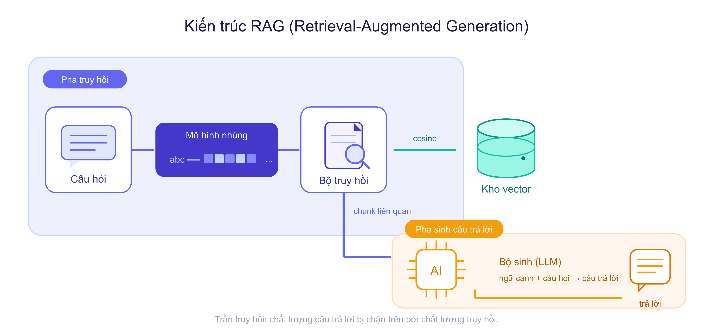
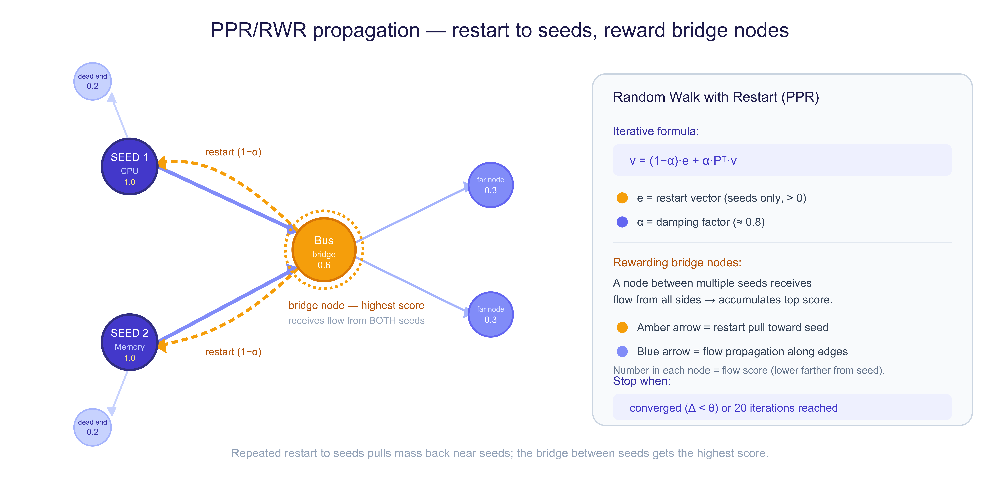

# TLU-Chatbot

> TLU-Chatbot is an open-source educational RAG system designed to help university students retrieve and reason over Vietnamese academic and institutional documents. Built on [LightRAG](https://github.com/HKUDS/LightRAG), it adds graph-based multi-hop retrieval using BFS flow propagation and Personalized PageRank.

## Abstract

TLU-Chatbot was developed around a real university use case: making fragmented Vietnamese academic documents easier for students to search and understand. Many questions require combining information across multiple sections or documents, motivating the project's graph-based retrieval approach.

This project extends LightRAG with a graph-oriented retrieval method for questions that require evidence beyond a single semantically similar chunk. The system constructs a knowledge graph from document chunks, combines graph and vector evidence through `mix` retrieval, and introduces a topology-aware `graph` mode based on BFS flow propagation and Personalized PageRank (PPR). The repository also includes ingestion, graph-cleaning, and multi-mode evaluation tooling.

## Architecture


The offline path parses documents, creates chunks, extracts entities and relations, embeds the resulting evidence, and writes to the vector and graph stores. The online path extracts query keywords, retrieves supporting context through one of five modes, and sends the assembled evidence to the LLM.

The implementation supports JSON or PostgreSQL-backed operational storage, `pgvector` for vector retrieval, and GraphML/NetworkX or a graph database for graph storage. The `workspace` setting isolates each collection's key-value, vector, and document-status namespaces.

## Method

### Offline ingestion and knowledge-graph construction


PDF and Markdown sources are parsed with Docling-aware ingestion, split into chunks, and passed to an LLM for entity and relation extraction. The pipeline retains chunk provenance and image mappings, then writes chunk embeddings and graph records to parallel stores. See [`notebook_ingest.py`](notebook_ingest.py) and [`operate.py`](LightRAG/lightrag/operate.py).

### Online retrieval and answer generation



The system exposes `naive`, `hybrid`, `mix`, `graph`, and `bm25` retrieval modes. `mix` fuses vector chunk evidence with graph context. `graph` uses the topology of the content graph to identify useful bridge entities before the final LLM response is generated.

## Contributions

### 1. BFS flow propagation for graph retrieval

The `graph` mode starts from entities selected by query similarity, then expands a local subgraph with a BFS-style flow rule. Each hop decays the parent flow by `alpha / degree(parent)`, which reduces the influence of high-degree hubs. Expansion stops when the flow falls below a threshold or the configured depth limit is reached. The implementation is in [`_perform_graph_ego_walk`](LightRAG/lightrag/operate.py#L3746).


### 2. PPR refinement of the BFS subgraph

The BFS flow initializes a Personalized PageRank iteration over the collected subgraph. This refinement redistributes score through graph structure, improving the ranking of bridge entities that may lie several hops from the initial seeds. The final ranking combines query similarity and graph-flow score; `GRAPH_FLOW_ALPHA`, `GRAPH_PPR_C`, `GRAPH_FLOW_THETA`, and related variables control the method.



### 3. Mixed graph-vector retrieval

`mix` retrieval combines vector-retrieved chunks with knowledge-graph context, while `graph` uses the BFS-PPR pipeline as a distinct topology-first path. This provides two complementary mechanisms: direct evidence fusion for mixed queries and structural exploration for multi-hop questions.

### 4. Evaluation and graph-quality workflow

The `eval/` tooling generates query sets, runs retrieval-mode comparisons, evaluates responses, performs pairwise judging, and produces dashboards. Graph audit and cleanup utilities identify noisy or duplicate nodes before evaluation.

## Reproduction

```bash
cd LightRAG
uv sync --extra api
cp env.example .env
python -m lightrag.api.lightrag_server
```

```bash
cd eval
python run_benchmark.py
python evaluate_benchmark.py --bootstrap 1000
python evaluate_pairwise.py
python build_dashboard.py
```

## Repository Map

```text
LightRAG/     Base framework, API, WebUI, and graph-retrieval implementation
eval/         Benchmarking, pairwise evaluation, graph audit, and cleanup
figures/      Architecture, ingestion, and retrieval diagrams used in this README
PDF/ and MD/  Source documents for ingestion
```

## Acknowledgements

This work builds on [LightRAG](https://github.com/HKUDS/LightRAG), released under the MIT License.
