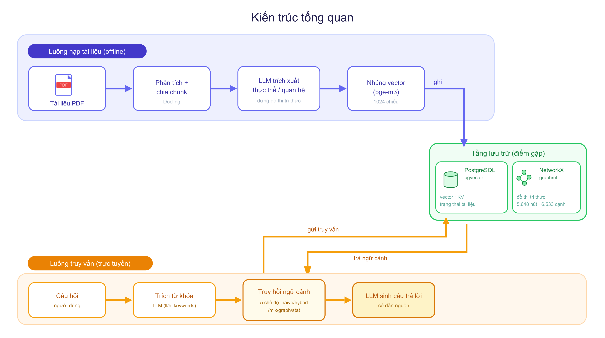
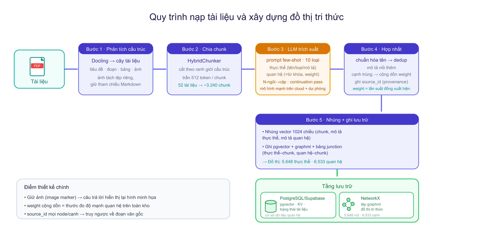
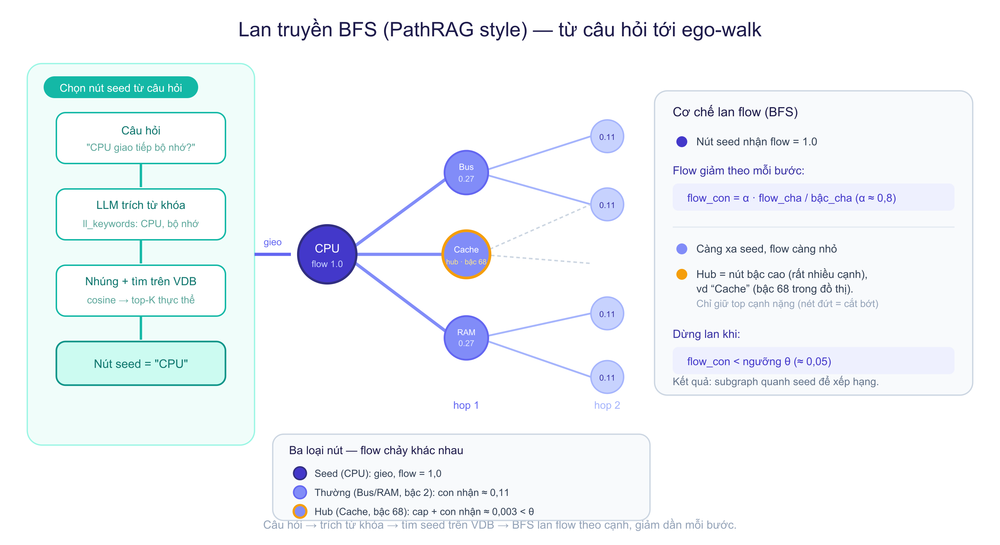

# LightRAG Graph Retrieval Extension

This repository extends [LightRAG](https://github.com/HKUDS/LightRAG) with a document-ingestion, graph-retrieval, and evaluation workflow for Vietnamese course materials. It combines chunk-level vector search with knowledge-graph traversal so that answers can use both semantic similarity and relationships across documents.

The upstream LightRAG implementation is retained in `LightRAG/`. The repository root contains the custom ingestion utilities, graph retrieval work, evaluation harness, datasets, diagrams, and supporting scripts.

## System Overview



The system has four stages:

1. **Ingest**: source PDFs and Markdown files are parsed, chunked, and prepared for multimodal indexing.
2. **Index**: chunks, embeddings, entities, relations, and image mappings are stored for retrieval.
3. **Retrieve**: a query is routed through one of several retrieval modes to collect relevant text and graph context.
4. **Generate**: the selected context is passed to an LLM, which returns an answer with source-aware context and inline image support when available.

## Architecture



### Ingestion and indexing

- `notebook_ingest.py` provides a document-ingestion flow with Docling support for PDF processing.
- The pipeline creates text chunks, extracts entities and relations with an LLM, and records chunk-to-image mappings for image-aware responses.
- The index can use JSON-backed storage for local development or PostgreSQL-backed implementations for production workloads.
- Vector embeddings are stored separately from the knowledge graph, allowing semantic and graph-based retrieval to be combined at query time.

### Storage layer

The repository is configured to work with the following storage roles:

| Concern | Local or default option | Production-oriented option |
| --- | --- | --- |
| Key-value and LLM cache | JSON storage | PostgreSQL key-value storage |
| Vector retrieval | Local/vector adapter | PostgreSQL with `pgvector` |
| Knowledge graph | NetworkX / GraphML | PostgreSQL graph storage or Neo4j |
| Document status | JSON status storage | PostgreSQL document-status storage |

The `workspace` setting isolates key-value, vector, and document-status namespaces so multiple collections can share an installation without mixing their operational data.

## End-to-End Flow



### 1. Prepare and ingest documents

Source files in `PDF/` and `MD/` are parsed into text and image content. The ingestion pipeline chunks the text, derives metadata, and sends chunks to the entity-and-relation extraction step.

### 2. Build parallel indexes

Each chunk is embedded for semantic retrieval. In parallel, extracted entities and relations form the knowledge graph. Image markers and mappings allow associated images to be reintroduced into the answer context when an indexed source supports them.

### 3. Retrieve context

At query time, the system can use the following retrieval modes:

- `naive`: vector-based retrieval over document chunks.
- `hybrid`: combines local and global retrieval context.
- `mix`: combines graph and vector context.
- `graph`: starts from semantically selected seed entities, then expands through the knowledge graph using graph-aware ranking.
- `bm25`: a lexical baseline used by the local evaluation workflow.

### 4. Generate the response

The selected chunks and graph context are assembled into an LLM prompt. The answer can include source context and, where a matching chunk-image mapping exists, relevant images from the indexed material.

## Project Contributions

This repository adds the following work on top of the upstream LightRAG codebase:

- **Graph ego-walk retrieval**: a `graph` query mode that selects seed entities from query embeddings, performs flow-based graph expansion, and applies Personalized PageRank refinement before ranking entities.
- **Knowledge-graph quality tooling**: scripts in `eval/` to audit noisy entities, identify duplicate or malformed graph nodes, and apply cleanup plans to GraphML and PostgreSQL-backed data.
- **Evaluation harness**: query generation, multi-mode benchmark execution, automatic evaluation, pairwise LLM judging, and dashboard generation for comparing retrieval modes.
- **Resilient extraction configuration**: separate extraction and query LLM paths, provider failover support, and safeguards for graph traversal edge cases.
- **Document and image-aware ingestion**: scripts and mappings that preserve the relationship between extracted text chunks and source images.

## Repository Layout

```text
.
├── LightRAG/        Upstream LightRAG library, API server, and WebUI
├── eval/            Benchmarking, graph audit, cleanup, and evaluation scripts
├── src/             Data preparation and corpus analysis utilities
├── PDF/             Source PDF corpus
├── MD/              Source Markdown corpus
├── assets/          Architecture and retrieval-flow diagrams
├── docs/            Design notes and algorithm explanations
├── figures/         Evaluation and pipeline figures
├── notebook_ingest.py
└── README.md
```

## Quick Start

### Prerequisites

- Python 3.10 or newer
- Bun, when building or running the WebUI
- An LLM provider and embedding configuration
- PostgreSQL with `pgvector` and/or a graph backend when using the production storage path

### Install and run the API

```bash
cd LightRAG
uv sync --extra api
cp env.example .env

cd lightrag_webui
bun install --frozen-lockfile
bun run build

cd ..
python -m lightrag.api.lightrag_server
```

Configure the required model, embedding, and storage values in `LightRAG/.env` before starting the server. For an editable Python installation, use `pip install -e ".[api]"` from `LightRAG/` instead of `uv sync --extra api`.

### Ingest content programmatically

```python
import asyncio

from lightrag import LightRAG, QueryParam
from lightrag.llm.openai import gpt_4o_mini_complete, openai_embed


async def main() -> None:
    rag = LightRAG(
        working_dir="./rag_storage",
        llm_model_func=gpt_4o_mini_complete,
        embedding_func=openai_embed,
    )
    await rag.initialize_storages()
    await rag.ainsert(["Document text to index"])

    answer = await rag.aquery(
        "Ask a question about the indexed content.",
        param=QueryParam(mode="graph"),
    )
    print(answer)


asyncio.run(main())
```

### Evaluate retrieval modes

```bash
cd eval
python run_benchmark.py
python evaluate_benchmark.py --bootstrap 1000
python evaluate_pairwise.py
python build_dashboard.py
```

The evaluation scripts write raw responses, metrics, and visual summaries beneath `eval/`.

### Audit and clean the knowledge graph

```bash
cd eval
python audit_graph.py
python apply_cleanup.py
```

Run the audit before applying cleanup. The cleanup workflow updates graph artifacts and related PostgreSQL rows according to the generated plan.

## Configuration Notes

- Copy `env.example` in `LightRAG/` to `.env` and provide only the services required by the selected LLM, embedding model, and storage adapters.
- Use the project configuration and Docker files when provisioning database dependencies locally or in containers.
- Refer to `LightRAG/docs/OfflineDeployment.md` for offline deployment guidance.
- The WebUI is located in `LightRAG/lightrag_webui/` and uses Bun for dependency management, development, builds, and tests.

## Development

Run checks from the `LightRAG/` directory:

```bash
ruff check .
python -m pytest tests

cd lightrag_webui
bun test
```

Use `python -m pytest tests --run-integration` only when the required external services and `LIGHTRAG_*` environment variables are available.

## Acknowledgements

This project builds on [LightRAG](https://github.com/HKUDS/LightRAG), released under the MIT License. See the upstream project for the base framework and its broader provider and storage support.
